# Analog Electronics Experiments & Systems Design

[](https://youtube.com/@arpit_iit.madras?si=c5lhNswLiiwFaNUQ)
[](https://www.iitm.ac.in)
[](https://www.analog.com/en/resources/design-tools-and-calculators/ltspice-simulator.html)
[](https://www.analog.com/en/resources/evaluation-hardware-and-software/evaluation-boards-kits/ADALM1000.html)
[-green?style=for-the-badge)](BS_Analog_Systems_Lab_Manual.pdf)

<p align="center">
  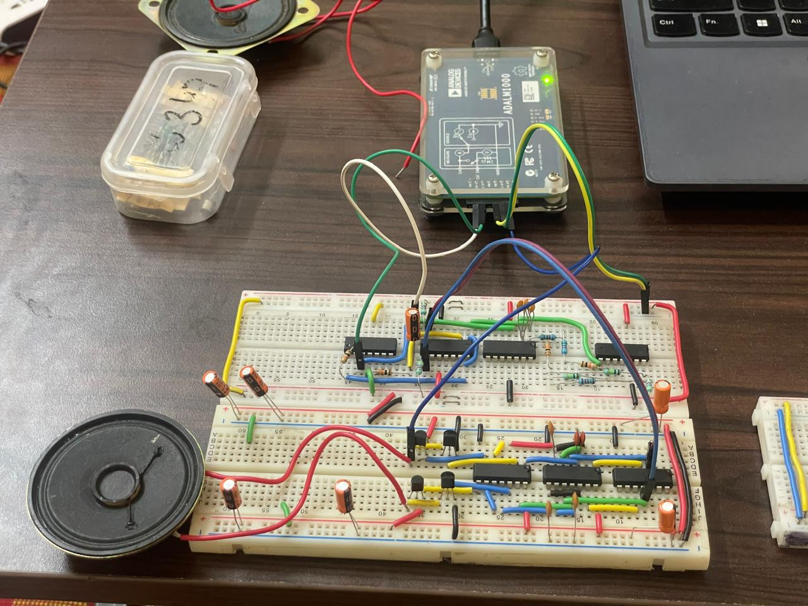
  <br>
  <em><b>Complete Integrated Analog Electronic System:</b> Active Filters, Op-Amp Adder, Differential PWM Modulator, and Discrete BJT H-Bridge driving a physical dynamic speaker via ADALM1000 Active Learning Module.</em>
</p>

---

## 📌 About the Project

This repository contains the complete laboratory experiments, circuit schematics, simulation models, design reports, hardware breadboard implementations, and official question manual for the **Analog Electronic Systems (AES) Lab** at **IIT Madras**, authored by **Arpit Katiyar**.

The overarching goal of the lab series is to design, model, simulate, and fabricate a full-featured **Analog Electronic Stethoscope & Class-D Audio Processing System** capable of conditioning audio/biomedical tones, filtering unwanted noise through dual second-order active bandpass filters, summing channels, and driving an $8\,\Omega$ / $32\,\Omega$ speaker with high efficiency.

---

## 📖 Official Question & Lab Manual

* 📄 **Original PDF Manual:** [**`BS_Analog_Systems_Lab_Manual.pdf`**](BS_Analog_Systems_Lab_Manual.pdf)
* 📝 **Web-Readable Lab Guide & Pre-Lab Exercises:** [**`LAB_MANUAL.md`**](LAB_MANUAL.md)

---

## 📺 Video Demonstrations

All practical circuit breadboard implementations, waveform measurements, and hardware testing runs are recorded and uploaded on YouTube:

> 🔗 **Watch all experiment demonstration videos here:**  
> **[YouTube: @arpit_iit.madras](https://youtube.com/@arpit_iit.madras?si=c5lhNswLiiwFaNUQ)**

<p align="center">
  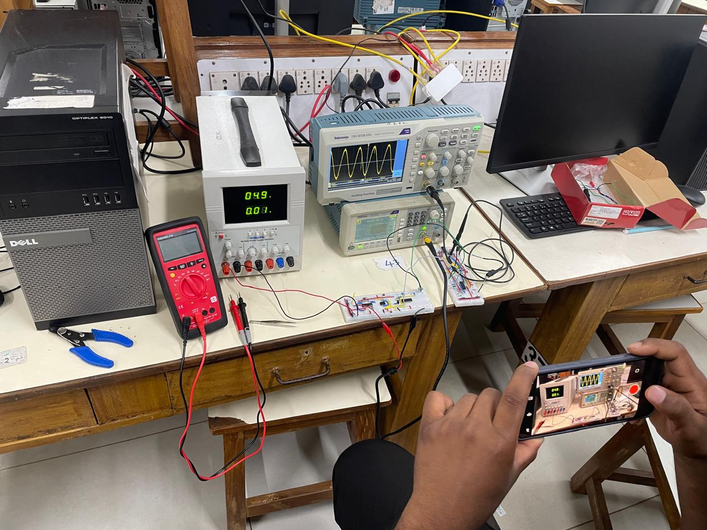
  <br>
  <em>Hardware verification and video recording at IIT Madras Electronics Lab using Tektronix Digital Storage Oscilloscope, Scientific DC Power Supply, and breadboard prototype.</em>
</p>

---

## 📑 Repository Structure

```text
.
├── README.md                                          # Main project overview & photo showcase
├── LAB_MANUAL.md                                      # Complete question manual & theory
├── BS_Analog_Systems_Lab_Manual.pdf                   # Official 14-page Lab Manual PDF
├── .gitignore                                         # Git ignore configuration
├── LICENSE                                            # MIT License
├── assets/
│   └── images/                                        # High-resolution hardware & scope captures
│       ├── system_integration_adalm1000_speaker.jpg   # Complete integrated system + ADALM1000 + speaker
│       ├── system_integration_dual_breadboard_top_view.jpg # Dual-breadboard complete circuit layout
│       ├── system_integration_full_breadboard_speaker.jpg  # Breadboard system and dynamic speaker
│       ├── system_integration_wiring_harness.jpg      # Harness wiring & ADALM1000 connections
│       ├── lab_bench_recording_demo.jpg               # Lab testing & YouTube recording setup
│       ├── lab_bench_full_system_test.jpg             # Bench testbench with DC supply & scope
│       ├── lab_bench_instruments_tektronix_scope.jpg  # Tektronix TBS 1072B-EDU scope & generator
│       ├── week1_ramp_square_alice_scope.jpg          # ALICE desktop oscilloscope (ramp + square)
│       ├── week1_ramp_waveform_measurement.jpg        # ALICE desktop scope trace capture
│       ├── week2_pwm_breadboard_annotated_layout.jpg  # Annotated IC wiring & pinout diagram
│       ├── week2_pwm_multimeter_alice_measurement.jpg # Fluke DMM & differential PWM scope signals
│       ├── week3_hbridge_driver_circuit.jpg           # Complementary BJT H-bridge power stage
│       ├── week3_comparator_pwm_driver.jpg            # MCP6004 & LM339 comparator driver stage
│       ├── week4_bandpass_filter_breadboard.jpg       # Second-order active bandpass filter circuit
│       ├── week4_filter_components_closeup.jpg        # Precision capacitors & resistor networks
│       └── week5_adder_circuit_probing.jpg            # Op-amp active summing mixer with test probes
├── Week-01_Ramp_Generator/
│   ├── Analog1.asc                                    # LTspice schematic (Ramp Generator)
│   ├── Analog1.log                                    # LTspice simulation log
│   ├── LM339.New.asy                                  # Custom symbol for LM339 comparator
│   ├── Analog_Lab_Week_1_Report.docx                  # Lab report with derivations & results
│   ├── week1_ramp_square_alice_scope.jpg              # Hardware scope measurement photo
│   └── week1_ramp_waveform_measurement.jpg            # Additional scope capture
├── Week-02_Differential_PWM/
│   ├── Analog1,2.asc                                  # LTspice schematic (Single-to-Diff & PWM)
│   ├── Analog1,2.log                                  # Simulation log
│   ├── LM339.asy                                      # Comparator symbol file
│   ├── Analog_Lab_Week_2_Report.docx                  # Complete laboratory documentation
│   ├── week2_pwm_breadboard_annotated_layout.jpg      # Annotated breadboard IC layout
│   └── week2_pwm_multimeter_alice_measurement.jpg     # ALICE & DMM measurement setup
├── Week-03_H-Bridge_Driver/
│   ├── Analog3.asc                                    # LTspice schematic (H-Bridge Class-D stage)
│   ├── Analog_Lab_Week_3_Report.pdf                   # Comprehensive Lab Report
│   ├── week3_hbridge_driver_circuit.jpg               # BJT H-Bridge stage photo
│   └── week3_comparator_pwm_driver.jpg                # Comparator driver stage photo
├── Week-04_Bandpass_Filter/
│   ├── Analog4,5.asc                                  # LTspice schematic (Active Bandpass Filter)
│   ├── Analog_Lab_Week_4_Report.pdf                   # Lab Report & Frequency Analysis
│   ├── week4_bandpass_filter_breadboard.jpg           # Active filter breadboard implementation
│   └── week4_filter_components_closeup.jpg            # Filter component close-up
├── Week-05_Adder_Circuit/
│   ├── Analog5.asc                                    # LTspice schematic (Active Adder / Mixer)
│   ├── Analog5.net                                    # SPICE netlist
│   ├── Analog_Lab_Week_5_Report.pdf                   # Final Lab Report
│   └── week5_adder_circuit_probing.jpg                # Summing amplifier with probe clips
└── Design-Projects_Amplifiers/
    ├── Trans-Impedence Amplifier.pdf                  # Precision TIA design & stability report
    └── Voltage Amplifier.pdf                          # 0-1V to 0-50V High-Voltage Amplifier report
```

---

## 🔬 Experiment Overview

### [Week 1: Ramp Wave Generator](Week-01_Ramp_Generator/)
* **Objective:** Design and implement a relaxation-oscillator ramp wave generator using an operational amplifier integrator stage and an LM339 Schmitt trigger comparator.
* **Formulas:**
  * Peak-to-peak Amplitude: $V_M = 2\left(\frac{R_2}{R_3}\right) V_{CM}$
  * Oscillation Frequency: $F_{SW} = \frac{R_3}{4 R_2 R_1 C_1}$
* **Key Components:** MCP6004 Quad Op-Amp, LM339 Comparator, timing resistor/capacitor network ($R_1 = 25\text{ k}\Omega$, $R_2 = 45\text{ k}\Omega$, $R_3 = 200\text{ k}\Omega$, $C = 10\text{ nF}$, pull-up $4.7\text{ k}\Omega$).
* **Hardware Setup:** Single-supply operation ($V_{DD} = 5\text{ V}$, $V_{CM} = 2.5\text{ V}$) tested using the ADALM1000 Active Learning Module.
* **Video Demonstration:** [Experiment 1: Ramp Generator](https://youtube.com/@arpit_iit.madras?si=c5lhNswLiiwFaNUQ)

<p align="center">
  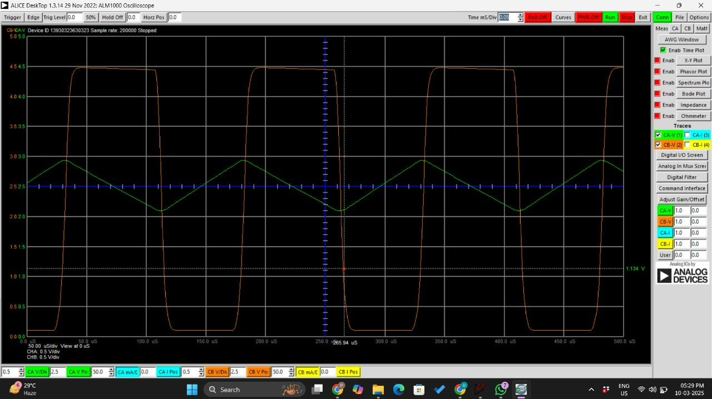
  <br>
  <em><b>Hardware Oscilloscope Capture (ALICE Desktop):</b> Measured triangle ramp output (CB-V - green, 1 Vpp @ 5 kHz centered at 2.5 V) and Schmitt trigger comparator output (CA-V - orange, 0 to 4.5 V).</em>
</p>

---

### [Week 2: Single-Ended to Differential Input Converter & PWM Modulator](Week-02_Differential_PWM/)
* **Objective:** Convert a single-ended analog audio/test signal into balanced differential signals ($V_{in+}$ and $V_{in-}$, 180° out of phase) and compare them with the ramp carrier to produce differential pulse-width modulated (PWM) switching signals (`PWM_P` and `PWM_N`).
* **Equations:**
  * $V_{in\_a+} = V_{in\_a(ac)} + V_{CM}$
  * $V_{in\_a-} = -V_{in\_a(ac)} + V_{CM}$
* **Key Components:** MCP6004 Op-Amp, dual LM339 comparators, RC demodulation/low-pass filters.
* **Validation:** Verified both on LTspice transient analysis and on breadboard hardware using ALICE desktop oscilloscope tools and digital multimeter.
* **Video Demonstration:** [Experiment 2: Single Ended-to-Differential Converter and PWM Modulator](https://youtube.com/@arpit_iit.madras?si=c5lhNswLiiwFaNUQ)

| Annotated Breadboard IC & Pinout Layout | Live Measurement Setup (ALICE & Fluke 101 DMM) |
|:---:|:---:|
| 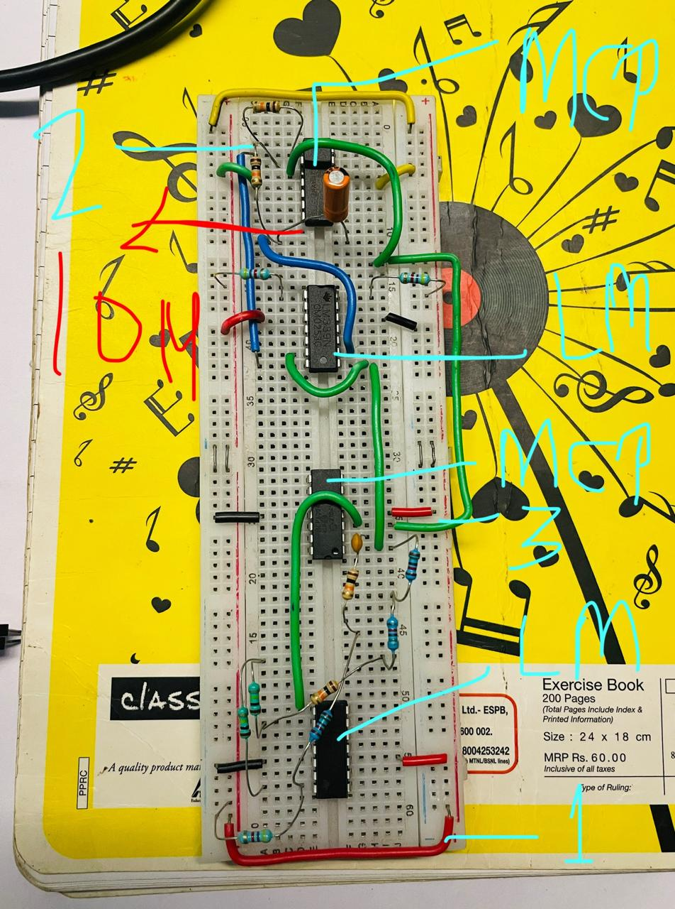 | 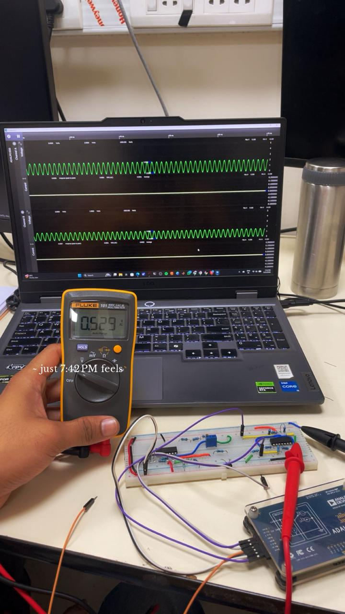 |
| *Breadboard IC placement: MCP6004 op-amp and LM339 comparator rail routing.* | *Live hardware measurement of differential audio waveforms and AC RMS voltage.* |

---

### [Week 3: H-Bridge Driver and Class-D Integration](Week-03_H-Bridge_Driver/)
* **Objective:** Build a discrete BJT H-Bridge power output stage driven by differential PWM signals to efficiently drive low-impedance inductive/resistive loads (speakers).
* **Key Components:** 2N2222 (NPN) and 2N2907 (PNP) BJTs, base drive networks, $32\,\Omega$ load resistor, coupling/filter capacitors.
* **Video Demonstration:** [Experiment 3: H-Bridge Driver and Integration](https://youtube.com/@arpit_iit.madras?si=c5lhNswLiiwFaNUQ)

<p align="center">
  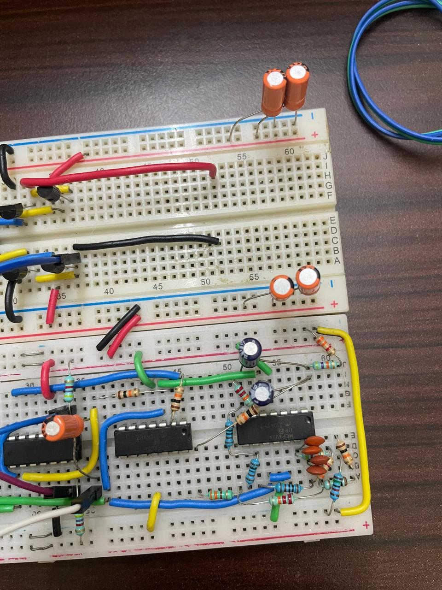
  <br>
  <em><b>Discrete Complementary BJT H-Bridge Stage:</b> 2N2222 NPN and 2N2907 PNP power switches with bulk supply bypass electrolytic capacitors to sink switching transients.</em>
</p>

---

### [Week 4: Active Bandpass Filter](Week-04_Bandpass_Filter/)
* **Objective:** Design, simulate, and physically implement two active bandpass filter circuits to isolate specific signal bandwidths ($f_{o1} = 156.25\text{ Hz}$, $f_{o2} = 625\text{ Hz}$, $Q = 10$, Gain $= 1$) while suppressing out-of-band harmonics and noise.
* **Transfer Function:**
  $$H(s) = \frac{A_0 \left(\frac{\omega_0}{Q}\right) s}{s^2 + \left(\frac{\omega_0}{Q}\right) s + \omega_0^2}$$
* **Video Demonstration:** [Experiment 4: Bandpass Filter](https://youtube.com/@arpit_iit.madras?si=c5lhNswLiiwFaNUQ)

<p align="center">
  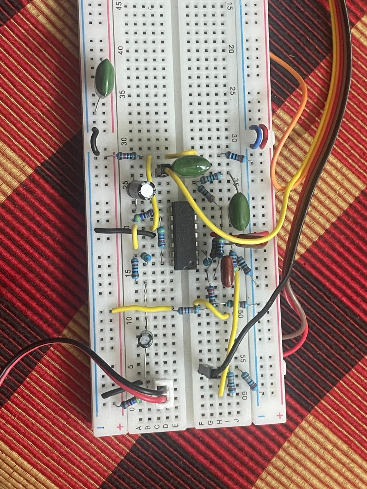
  <br>
  <em><b>Active Multiple-Feedback Bandpass Filter:</b> MCP6004 op-amp with precision polyester film capacitors and metal film resistors tuned to 156.25 Hz and 625 Hz center frequencies.</em>
</p>

---

### [Week 5: Active Adder / Audio Mixer Circuit](Week-05_Adder_Circuit/)
* **Objective:** Design an active summing amplifier to combine the filtered audio channels ($V_{out\_bpf1}$ and $V_{out\_bpf2}$) with minimal cross-talk and uniform gain response before Class-D power amplification.
* **Analysis:** AC, transient, and operating-point DC sweep simulations; physical circuit verification on breadboard.
* **Video Demonstration:** [Experiment 5: Adder Circuit](https://youtube.com/@arpit_iit.madras?si=c5lhNswLiiwFaNUQ)

<p align="center">
  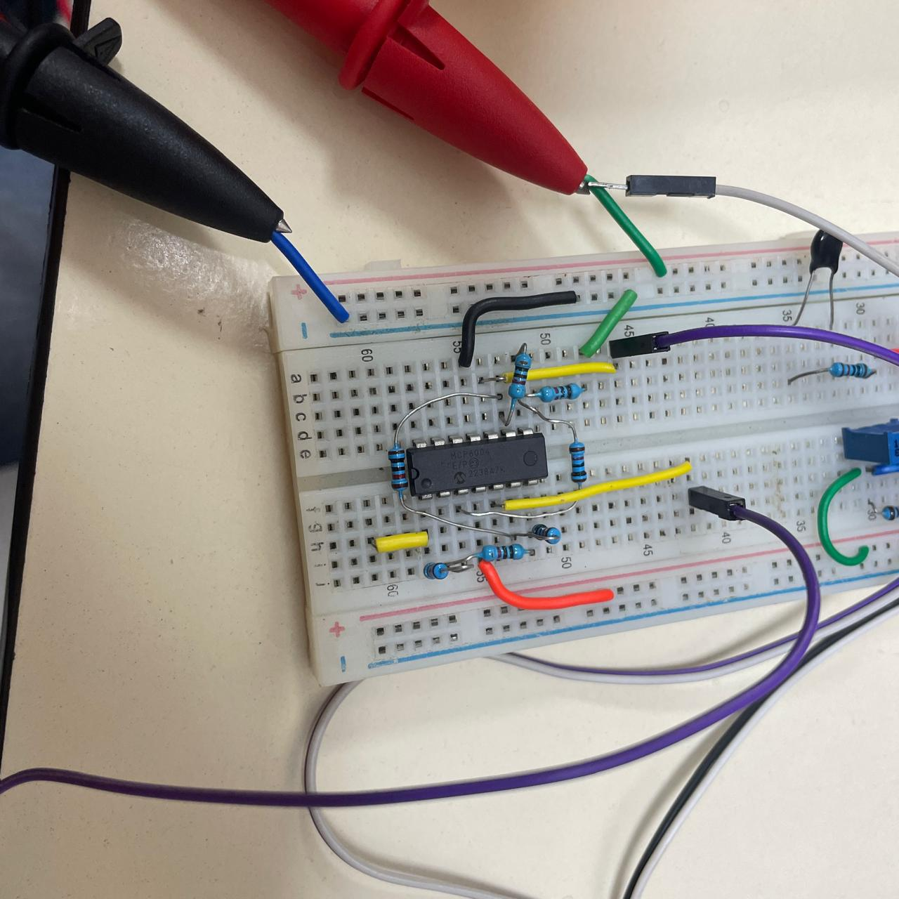
  <br>
  <em><b>Active Summing Mixer Node Probing:</b> Diagnostic oscilloscope and multimeter probes attached to summing junction and virtual common-mode reference node ($V_{CM} = 2.5\text{ V}$).</em>
</p>

---

### [Experiment 6: Top-Level System Integration](LAB_MANUAL.md#experiment-6-top-level-integration)
* **Objective:** Combine all five functional subsystems (Ramp Generator, Differential Modulator, H-Bridge Driver, Bandpass Filters, Adder) into a fully integrated analog audio / electronic stethoscope system driving a physical speaker load.
* **Grounding & Noise Isolation:** Implemented star-grounding topology for $V_{DD}$ and GND ($V_{SS}$) to prevent switching noise from the Class-D stage from polluting the high-gain analog filters.

| Complete Dual-Breadboard Architecture (Top-Down) | System Interconnect Harness to ADALM1000 & Speaker |
|:---:|:---:|
| 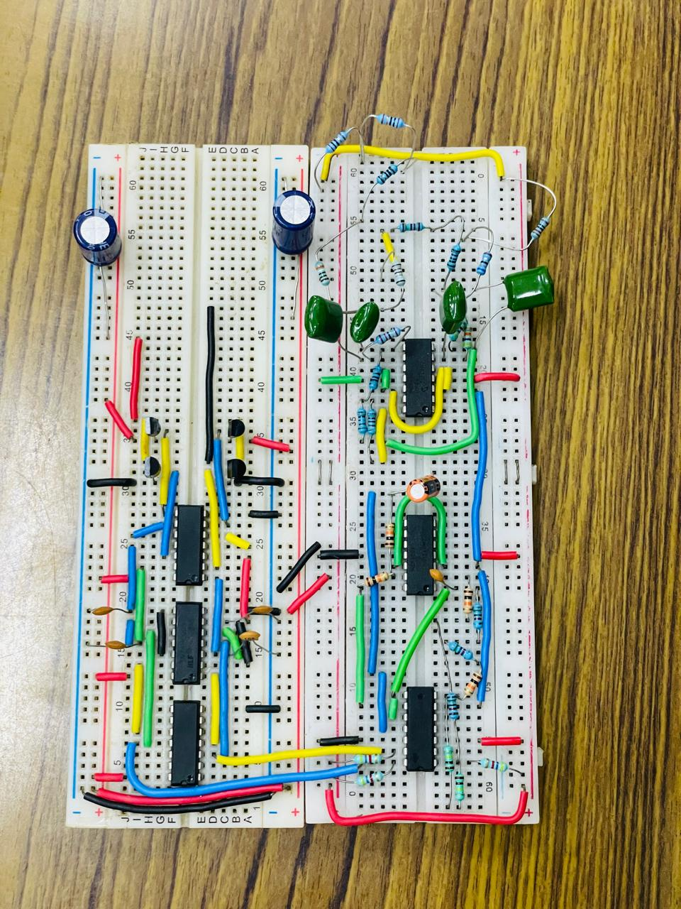 | 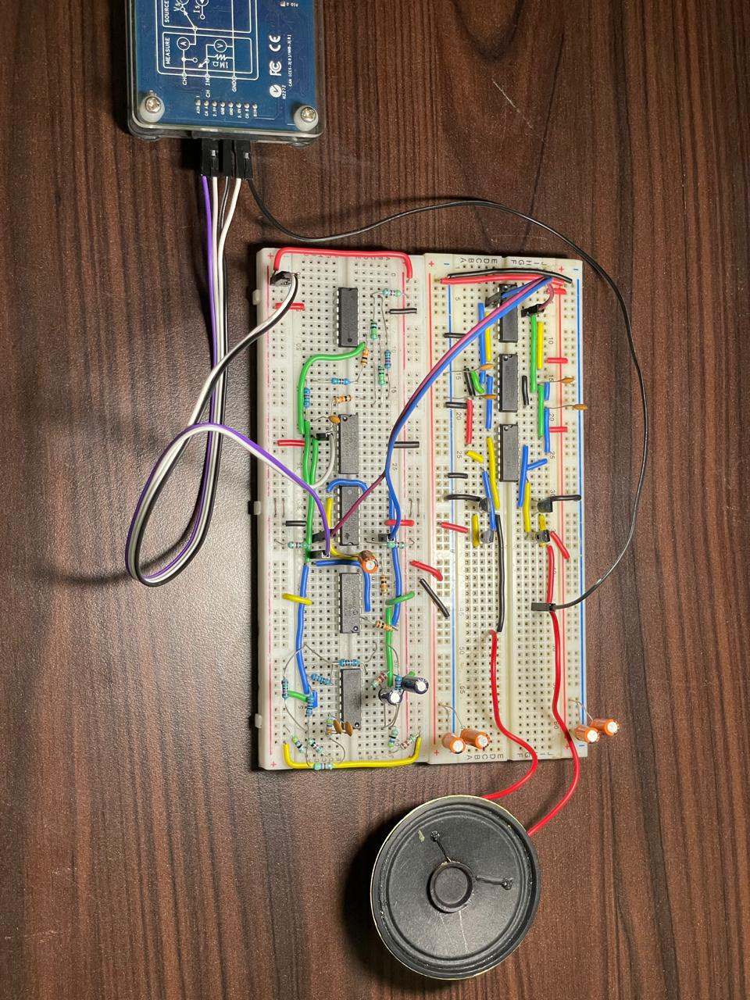 |
| *Unified system layout showing active filters, adder, triangle carrier generator, PWM modulator, and BJT H-bridge.* | *Integrated system driven by ADALM1000 power/signal lines and connected to a 32Ω dynamic acoustic transducer.* |

---

## ⚡ Advanced Amplifier Design Projects

Located in the [`Design-Projects_Amplifiers/`](Design-Projects_Amplifiers/) directory:

1. **Transimpedance Amplifier (TIA) for Photodiode Front-Ends:**
   * Design of transimpedance feedback network ($R_f = 1\text{ k}\Omega$ to $50\text{ k}\Omega$, $C_f$).
   * AC stability analysis ensuring phase margin $\ge 60^\circ$ across photodiode junction capacitance ($2\text{--}10\text{ pF}$).
   * Input-referred current noise analysis and transient step response comparison between LTC6268 and UniversalOpAmp2.

2. **High-Voltage Actuator Driver ($0\text{--}1\text{ V} \to 0\text{--}50\text{ V}$):**
   * Non-inverting high-voltage amplifier design with gain $A_v \approx 50\times$.
   * Capacitive load handling ($10\text{--}200\text{ nF}$) modeling piezoelectric (PZT) transducers.
   * Closed-loop stability, step response, output noise spectrum, and supply rail constraints using LTC6090.

---

## 🛠️ Tools & Technologies

| Category | Tools / Components |
|---|---|
| **Simulation** | LTspice XVII / 24 |
| **Hardware Instrument** | Analog Devices ADALM1000 (Active Learning Module), Tektronix TBS 1072B-EDU Digital Oscilloscope, Scientific PSD3304 DC Power Supply |
| **Measurement Software**| ALICE Desktop, Pixelpulse |
| **Multimeter** | Fluke 101 Digital Multimeter |
| **Active ICs** | MCP6004 (Quad Rail-to-Rail Op-Amp), LM339 (Quad Comparator), LTC6090, LTC6268 |
| **Discrete Semis** | 2N2222 (NPN), 2N2907 (PNP) |
| **Acoustic Transducer**| $8\,\Omega$ / $32\,\Omega$ dynamic cone speaker |
| **Documentation** | LaTeX, Microsoft Word, PDF Reports, Official Question Manual |

<p align="center">
  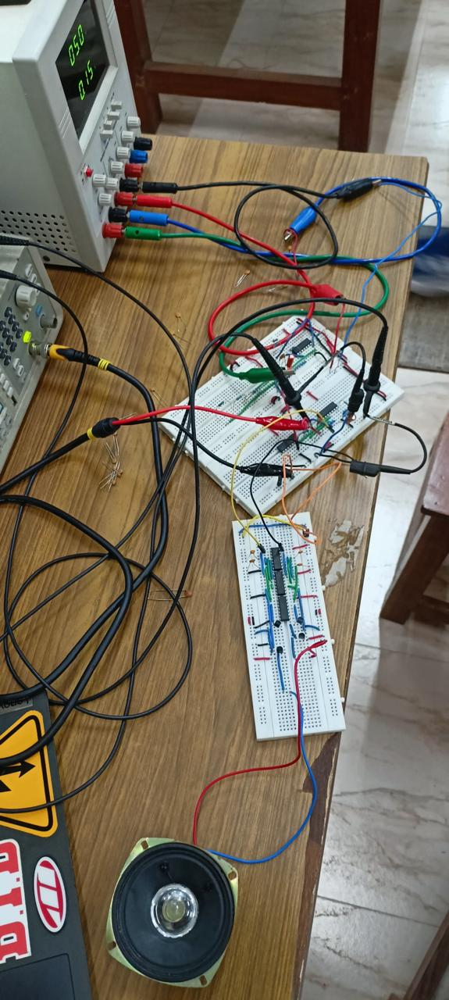
  <br>
  <em>Complete IIT Madras laboratory test bench: Scientific PSD3304 DC Power Supply, Tektronix Oscilloscope, signal generator, breadboard, and dynamic speaker load.</em>
</p>

---

## 🚀 How to Run the Simulations

1. Download and install [LTspice](https://www.analog.com/en/resources/design-tools-and-calculators/ltspice-simulator.html).
2. Clone this repository:
   ```bash
   git clone https://github.com/123Arp/Analog-Electronics-Experiments.git
   cd Analog-Electronics-Experiments
   ```
3. Open any `.asc` file in LTspice (e.g. `Week-01_Ramp_Generator/Analog1.asc`).
   * *Note: Keep custom symbol files (such as `LM339.New.asy` or `LM339.asy`) in the same directory as the schematic so LTspice resolves component models automatically.*
4. Click the **Run** button (running man icon) in LTspice to view simulated waveforms.

---

## 👤 Author

* **Arpit Katiyar**
* Indian Institute of Technology Madras (IIT Madras)
* 📺 YouTube: [@arpit_iit.madras](https://youtube.com/@arpit_iit.madras?si=c5lhNswLiiwFaNUQ)
* 🐙 GitHub: [@123Arp](https://github.com/123Arp)

---

## 📜 License

This project is licensed under the [MIT License](LICENSE).